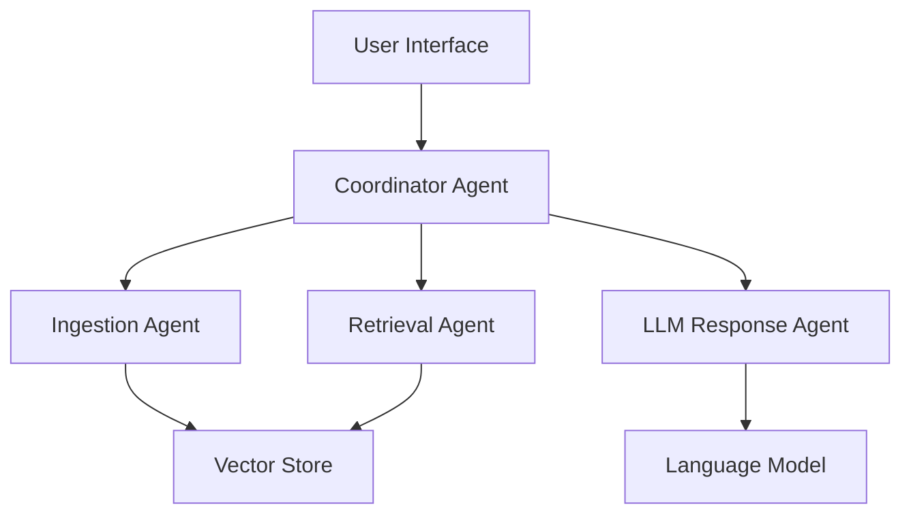

# Converse-AI - Agentic-RAG-chatbot

An intelligent multi-agent RAG (Retrieval-Augmented Generation) chatbot that processes multiple document formats using Model Context Protocol (MCP) for seamless agent communication.

##  Features

- **Multi-Format Document Support**: PDF, PPTX, CSV, DOCX, TXT, Markdown
- **Agentic Architecture**: 3+ specialized agents with MCP communication
- **Semantic Search**: Advanced vector embeddings with FAISS/Chroma
- **Modern UI**: React-based interface with real-time chat
- **Multi-turn Conversations**: Context-aware dialogue system
- **Source Attribution**: View document sources for each response

##  Architecture

## Agent Responsibilities

🔄 CoordinatorAgent: Orchestrates workflow and manages MCP message routing
📄 IngestionAgent: Parses and preprocesses documents into chunks
🔍 RetrievalAgent: Handles embeddings and semantic search
🧠 LLMResponseAgent: Generates contextual responses using retrieved information

## Quick Start
Prerequisites

Python 3.8+
Node.js 16+
OpenAI API Key (or HuggingFace)

Installation

Clone the repository
bashgit clone https://github.com/yourusername/spanner-ai-rag.git
cd spanner-ai-rag

Backend Setup
bashcd backend
python -m venv venv
source venv/bin/activate  # On Windows: venv\Scripts\activate
pip install -r requirements.txt

Frontend Setup
bashcd frontend
npm install

Environment Configuration
bashcp .env.example .env
# Edit .env with your API keys

Run the Application
bash# Terminal 1 - Backend
cd backend
python main.py

# Terminal 2 - Frontend
cd frontend
npm start

Access the Application
Open http://localhost:3000 in your browser

## Project Structure
spanner-ai-rag/
├── backend/
│   ├── agents/
│   │   ├── __init__.py
│   │   ├── coordinator_agent.py
│   │   ├── ingestion_agent.py
│   │   ├── retrieval_agent.py
│   │   └── llm_response_agent.py
│   ├── core/
│   │   ├── __init__.py
│   │   ├── mcp_protocol.py
│   │   ├── document_parser.py
│   │   └── vector_store.py
│   ├── api/
│   │   ├── __init__.py
│   │   └── routes.py
│   ├── config/
│   │   ├── __init__.py
│   │   └── settings.py
│   ├── requirements.txt
│   └── main.py
├── frontend/
│   ├── public/
│   ├── src/
│   │   ├── components/
│   │   ├── pages/
│   │   ├── services/
│   │   └── App.js
│   ├── package.json
│   └── package-lock.json
├── docs/
│   ├── architecture.md
│   ├── mcp_protocol.md
│   └── deployment.md
├── tests/
├── .env.example
├── .gitignore
├── LICENSE
└── README.md
   Configuration
Environment Variables (.env)
env# API Keys
OPENAI_API_KEY=your_openai_key_here
HUGGINGFACE_API_KEY=your_hf_key_here

# Vector Store
VECTOR_STORE_TYPE=faiss  # or chroma
EMBEDDING_MODEL=text-embedding-ada-002

# Server Configuration
BACKEND_PORT=8000
FRONTEND_PORT=3000
DEBUG=true

# MCP Settings
MCP_TRACE_ENABLED=true
MCP_LOG_LEVEL=INFO
  MCP Message Examples
Ingestion Request
json{
  "type": "INGESTION_REQUEST",
  "sender": "CoordinatorAgent",
  "receiver": "IngestionAgent",
  "trace_id": "ing-123",
  "payload": {
    "document_path": "uploads/sales_report.pdf",
    "document_type": "pdf"
  }
}
Retrieval Response
json{
  "type": "RETRIEVAL_RESULT",
  "sender": "RetrievalAgent", 
  "receiver": "LLMResponseAgent",
  "trace_id": "rag-457",
  "payload": {
    "retrieved_context": ["Q1 revenue increased by 15%", "KPIs tracked: CAC, LTV, MRR"],
    "query": "What KPIs were tracked in Q1?",
    "similarity_scores": [0.89, 0.85]
  }
}
 Testing
bash# Run backend tests
cd backend
python -m pytest tests/

# Run frontend tests
cd frontend
npm test
 Documentation

Architecture Overview
MCP Protocol Details
Deployment Guide

 Contributing

Fork the repository
Create your feature branch (git checkout -b feature/AmazingFeature)
Commit your changes (git commit -m 'Add some AmazingFeature')
Push to the branch (git push origin feature/AmazingFeature)
Open a Pull Request

📄 License
This project is licensed under the MIT License - see the LICENSE file for details.
 Acknowledgments

Model Context Protocol (MCP) community
OpenAI for embeddings and LLM APIs
The open-source RAG community

 
